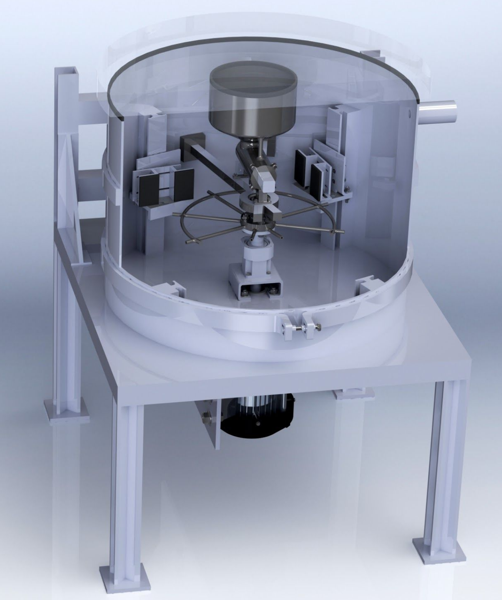

# Abrasive Jet in Vacuum

> A novel design for machining glass. Particularly useful for creating square channels of significant depth.
---

### Table of Contents

- [Abrasive Jet in Vacuum](#abrasive-jet-in-vacuum)
  - [Table of Contents](#table-of-contents)
  - [Description](#description)
      - [Technologies](#technologies)
  - [What I learnt](#what-i-learnt)

---

## Description

The design was motivated by the need to create channels in glass panels without making cracks. The issue with other machining methods is that you either do not have granular control of the tool, or the machining process leaves unwanted shapes at the bottom of the channel. This method allows for cutting the glass without cracking in a clean square cross-section of any desired depth.

#### Technologies

- Abrasive sand machining 
- Solidworks
- Vibration analysis 
- Finite element analysis

[Back To The Top](#Abrasive-Jet-in-Vacuum)

---

## What I learnt

>- How to simulate particle trajectory recursively to estimate final impact speed in Matlab and python.
>
>- Making tables with pandas for easy reporting of data. 
>
>- Material fatigue analysis, to determine shaft diameter.  
>
>- Vibration analysis, to determine allowable eccentricity of parts loaded on the main rotating shaft in Matlab.
>
>- Solidworks modelling of parts to check for fit and render publication-ready images. 
>
>- Project management and planning to meet all deadlines on time, even with the start of COVID-19 all deadlines were met. 
>
>- Team workload distribution, to make sure each team member likes what they do and has the resources they need to do it. 

[Back To The Top](#Abrasive-Jet-in-Vacuum)

